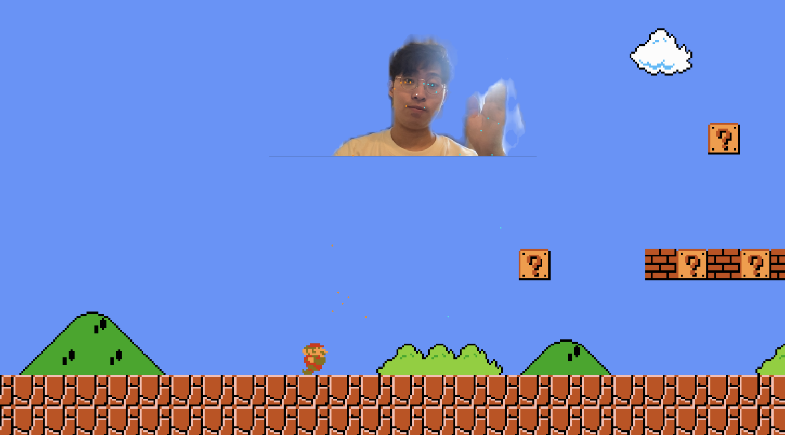

# Madio (Mad + Mario)
Welcome to Mardio! Get ready for an extraordinary adventure where your voice and body controls the game!



## Instructions

**Moving Forward**: Bend forward to make Mario move forward. As if you're bowing in Asian style! 

**Moving Backward**: Bend your upper body left and right to make Mario move backward. It's a good trunk exercise! 

**Jumping**: Let out a loud scream to make Mario jump. The louder your scream, the higher he will jump! 

**Remember**: Bend forward to move ahead, bend left and right to move backward, and scream for impressive jumps!

## Project Installation
1. Open `PoseMario.scene`
2. Download MediaPipe Unity Plugin [Download](https://github.com/homuler/MediaPipeUnityPlugin/releases/download/v0.12.0/MediaPipeUnity.0.12.0.unitypackage)
3. Drag and Drop the Unity Editor to install the plugin package 
4. Add `MotionProxy.GetInstance().SetPoseLandmark(eventArgs.value);` into `OnPoseLandmarksOutput` method in `PoseTrackingSolution.cs`
```csharp
private void OnPoseLandmarksOutput(object stream, OutputEventArgs<NormalizedLandmarkList> eventArgs)
{
    MotionProxy.GetInstance().SetPoseLandmark(eventArgs.value);
    _poseLandmarksAnnotationController.DrawLater(eventArgs.value);
}
```
5. Done!

## Disclaimer
The Super Mario Bros game in this project is oringed by [zigurous/unity-super-mario-tutorial](https://github.com/zigurous/unity-super-mario-tutorial) repository.


